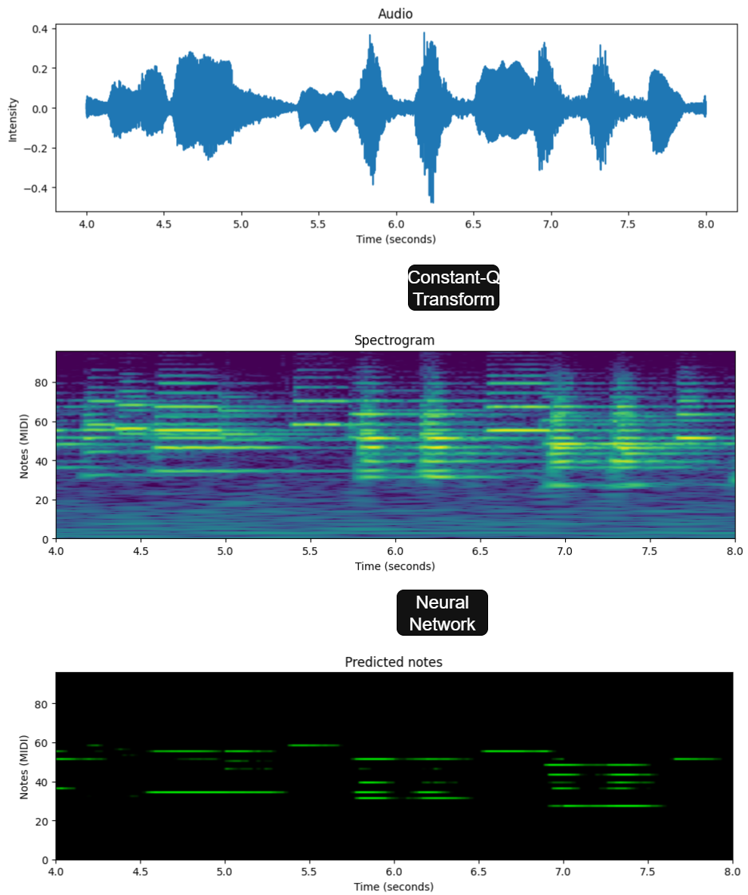
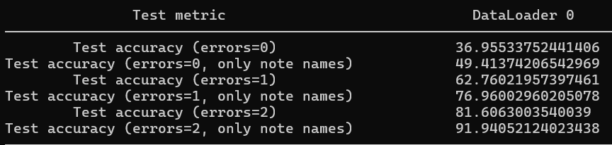
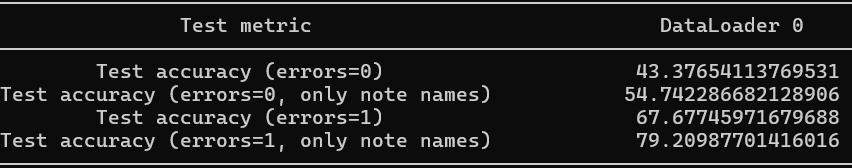

# Music transcription

Model to predict musical pitch from a song's audio implemented in pytorch.

I built this as a personal project to solve an interesting machine learning task that requires large amounts of data.

Inspiration/baseline: <a href="https://projects.iq.harvard.edu/files/kakade/files/1611-09827-2017.pdf">Learning Features of Music from Scratch</a>

## Methodology

Pre-processing consists of applying the <a href="https://en.wikipedia.org/wiki/Constant-Q_transform">Constant-Q transform</a> to the raw audio signal. This produces a spectrogram representation that behaves more uniformly across different pitch ranges, making it better suited for musical analysis.

The resulting spectrogram is divided into short one-second segments. Each of these segments is first passed through a shallow convolutional encoder that extracts a compact representation of the frequency patterns, and these encoded sequences are then processed with a transformer model applied along the time dimension to extract temporal information. Finally, a small feed-forward network maps the model's output to note predictions over time.

<div align="center">
  
  <figcaption><em>Figure 1. Illustration of classification process.</em></figcaption>
  <br><br>
</div>

For training, I used the <a href="https://zenodo.org/records/5120004">Musicnet dataset</a>, a collection of ~300 freely-licensed classical recordings annotated by experts. The training objective is binary cross-entropy loss, and the accuracy is the fraction of time-steps where the model correctly predicted every single note.

I implemented a "lazy dataloader" that only reads a batch from disk when it's being used because the dataset is too big to fit into VRAM when using multiple workers. This allows optimal GPU utilization which decreases training time.

All models were trained using an NVIDIA RTX 4070.

## Usage

The project can be run in two modes: data preprocessing and model training/testing. Both are handled through subcommands of the main script.

### Preprocessing

To preprocess raw audio into spectrogram chunks:

```python src preprocess```

Default options:

`--split train` - dataset split to process (train or test)

`--num-workers 8` - number of workers for preprocessing

`--batch-seconds 1` - length (in seconds) of each chunk

`--bins-per-note 4` - frequency bins per note

`--sr 22050` - sample rate

`--hop-length 512` - hop length for the transform

`--only-note-names` - if provided, use notes modulo 12

`--n-batches 60` - number of batches to save per file

### Training and Testing

To train a transformer model and evaluate it:

```python src train```

Default options:

`--batch-size 8` - batch size for training

`--num-workers 8` - dataloader workers

`--lr 5e-4` - learning rate

`--epochs 25` - number of training epochs

`--allowed-errors 0 1 2` - list of tolerances for evaluation metrics

`--n-layers 4` - number of transformer layers

`--n-heads 4` - number of attention heads

`--head-dim 32` - dimension of each attention head

`--c 3` - convolutional channel multiplier

`--embed-dim 192` - embedding dimension

`--load-weights` - either "main" or "dev", which model (if any) to continue training

## Architecture

The current architecture is a small CNN encoder followed by multiple Transformer layers and a small MLP decoder. The Transformer contains Self-Attention (which extracts temporal features) and MLP layers (which extract frequency features).

`model_weights.pth`: `n_layers=4`, `n_heads=4`, `head_dim=32`, `c=3`, `embed_dim=192` (1.8M params).
- Best learning rate found: `lr=5e-4`, `test_acc = 30%` (`43%` for note names)
- Validation stopped improving at `loss=3.9`, `acc=30%`, while training loss reached `loss=3.7`

## Experiment results

- Frequency convolutions larger than 1.5 notes result in lower accuracy

- Maxpool in the encoding CNN doesn't significantly affect performance

- Even a single fully connected layer in the frequency dimension significantly improves accuracy

- Temporal convolutions or temporal fully connected layers don't significantly improve performance

- Self-attention over a short time range (1s) improves accuracy from 25% (CNN + MLP) to 30% (CNN + Transformer + MLP)

- Fixed sinusoidal positional encoding performs equally well as a 1d temporal convolution

## TODO

[X] Explore long-range temporal attention (accross 1min instead of 1s) and test if it improves accuracy.

[X] Try training a larger model to see if the test accuracy plateau is a consequence of model expresivity or of data.

[ ] Try different pre-processing techniques besides STFT and Constant-Q transform to see if this is why the model still has low accuracy.

[ ] Once a better model is trained, implement a real time pipeline to use it.

## New experiments

I tried the model where I take a [0.5 octaves, 0.5 seconds] block and encode it as a vector, then do attention and then decode it.

- First model: `dim=48` and `100k` parameters for 20 epochs. Achieved acc `19.3` (`28.6` only note names)

- Second model: `dim=96` and `800k` parameters. Achieved acc `30.6` (~`40.0` only note names) by epoch 22

This worked equally well with `filter_scale=0.25` than with `0.5`

- Third model: `dim=192` and `3.2M` parameters. Achieved acc `32.5` (~`43.3` only note names) by epoch 12, and 30% at epoch 7

I tried the same model but using [0.25 octaves, 0.25 seconds] blocks and criss-cross attention.

- `dim=96` and `1M` parameter model achieves `37.2` (~`50%` only note names) by epoch 19.



Something interesting is that models that perform better do so even if the training loss is higher. They generalize better.

### Best architecture

It's a combination of transformers and CNNs. Take the input (time, freq, dim), apply 1D convolutions in the time axis and self-attention in the frequency axis.

I use a 5 second window with 8 samples per note. The patch size is [0.41 seconds, 0.25 octaves]

- `dim=96`, `depth=3`, `400K` parameter model achieves `43.5%` accuracy



- `dim=128`, `depth=4`, `900K` parameter models achieves `45.3%` accuracy but starts overfitting soon after

### TODO v2

[ ] Factor the problem. Idea: detect onsets (at each frequency) and predict durations
    Recall the dataset has onset and exact length information. This reduces the label space significantly

[ ] Musical prior: add some form of smoothness loss and information about harmonics
    Time: KL divergence d(p||q) seems fine (between consecutive frames). The infinities are not a problem because they are log
    Frequency: predict chords first, then punish weird notes for the chord

[ ] Consider focal loss and research other extensions that may help
    It seems to be ideal for unbalanced data. It focuses on "hard examples" (i.e. no rewarding for easy negatives) [https://arxiv.org/pdf/1708.02002]

[ ] Consider fitting an HMM to the model outputs

[ ] Switch to HCQT (https://www.mdpi.com/2079-9292/10/7/810)

[ ] Add new data, e.g. MAESTRO (only piano), MAPS, or MIDI files

### New architecture

I will try to improve the current best architecture (transformer in frequency + CNN in time). I will add a CCA component in time, so effectively each layer has three parts:
- Self-attention over frequency
- CNN + CCA over time (done in parallel with self-attention)
- MLP on each patch
