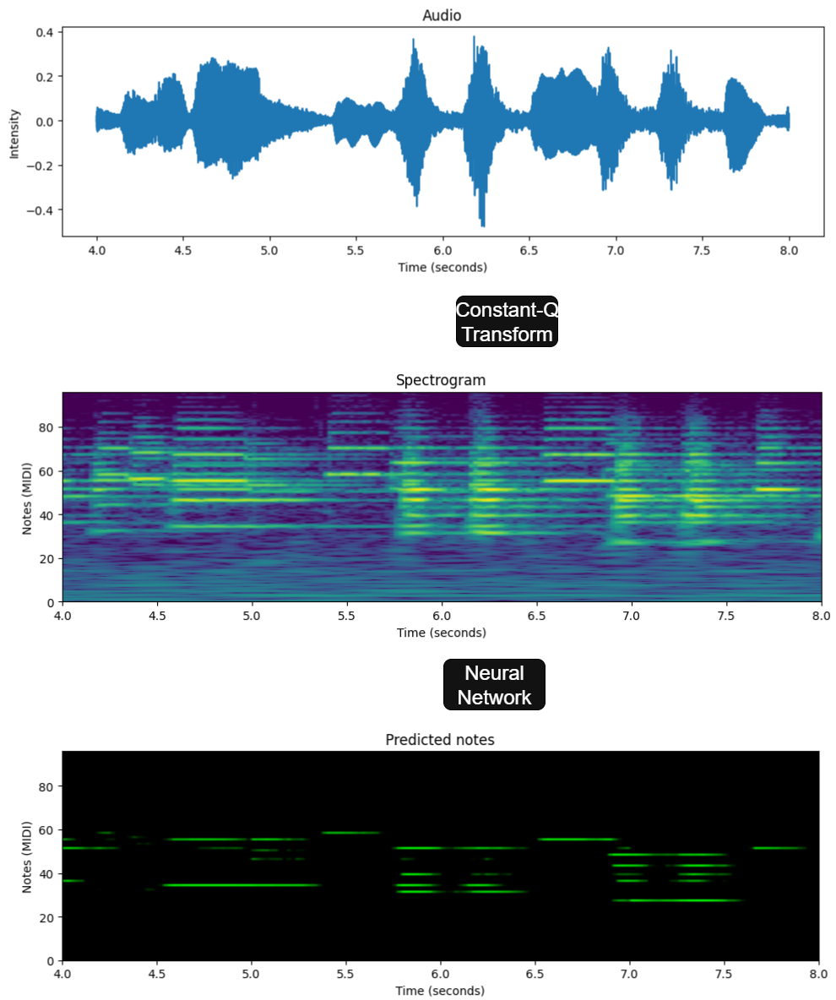

# Music transcription

Model to predict musical pitch from a song's audio implemented in pytorch.

I built this as a personal project to solve a non-trivial machine learning task that requires larger amounts of data.

Inspiration/baseline: <a href="https://projects.iq.harvard.edu/files/kakade/files/1611-09827-2017.pdf">Learning Features of Music from Scratch</a>

## Methodology

The processing pipeline begins by applying the <a href="https://en.wikipedia.org/wiki/Constant-Q_transform">Constant-Q transform</a> to the raw audio signal. This produces a spectrogram representation that behaves more uniformly across different pitch ranges, making it better suited for musical analysis.

The resulting spectrogram is divided into short one-second segments. Each of these segments is first passed through a shallow convolutional encoder that extracts a compact representation of the frequency patterns, and these encoded sequences are then processed with a transformer model applied along the time dimension to extract temporal information. Finally, a small feed-forward network maps the model's output to note predictions over time.

<div align="center">
  
  <figcaption><em>Figure 1. Illustration of classification process.</em></figcaption>
  <br><br>
</div>

For training, I used the <a href="https://zenodo.org/records/5120004">Musicnet dataset</a>, a collection of ~300 freely-licensed classical recordings annotated by experts. The training objective is binary cross-entropy loss, and the accuracy is the fraction of time-steps where the model correctly predicted every single note.

## Usage

The project can be run in two modes: data preprocessing and model training/testing. Both are handled through subcommands of the main script.

### Preprocessing

To preprocess raw audio into spectrogram chunks:

```python src preprocess```

Default options:

`--split train` - dataset split to process (train or test)

`--num-workers 8` - number of workers for preprocessing

`--batch-seconds 1` - length (in seconds) of each chunk

`--bins-per-note 4` - frequency bins per note

`--sr 22050` - sample rate

`--hop-length 512` - hop length for the transform

`--only-note-names` - if provided, use notes modulo 12

`--n-batches 60` - number of batches to save per file

### Training and Testing

To train a transformer model and evaluate it:

```python src train```

Default options:

`--batch-size 8` - batch size for training

`--num-workers 8` - dataloader workers

`--lr 5e-4` - learning rate

`--epochs 25` - number of training epochs

`--allowed-errors 0 1 2` - list of tolerances for evaluation metrics

`--n-layers 4` - number of transformer layers

`--n-heads 4` - number of attention heads

`--head-dim 32` - dimension of each attention head

`--c 3` - convolutional channel multiplier

`--embed-dim 192` - embedding dimension

`--load-weights` - either "main" or "dev", which model (if any) to continue training

## Architecture

The current architecture is a small CNN encoder followed by multiple Transformer layers and a small MLP decoder. The Transformer contains Self-Attention (which extracts temporal features) and MLP layers (which extract frequency features).

`model_weights.pth`: `n_layers=4`, `n_heads=4`, `head_dim=32`, `c=3`, `embed_dim=192` (1.8M params).
- Best learning rate found: `lr=5e-4`, `test_acc = 30%` (`43%` for note names)
- Validation stopped improving at `loss=3.9`, `acc=30%`, while training loss reached `loss=3.7`

## Experiment results

- Frequency convolutions larger than 1.5 notes result in lower accuracy

- Maxpool in the encoding CNN doesn't significantly affect performance

- Even a single fully connected layer in the frequency dimension significantly improves accuracy

- Temporal convolutions or temporal fully connected layers don't significantly improve performance

- Self-attention over a short time range (1s) improves accuracy from 25% (CNN + MLP) to 30% (CNN + Transformer + MLP)

- Fixed sinusoidal positional encoding performs equally well as a 1d temporal convolution

## TODO

- Explore long-range temporal attention (accross 1min instead of 1s) and test if it improves accuracy.

- Try training a larger model to see if the test accuracy plateau is a consequence of model expresivity or of data.

- Try different pre-processing techniques besides STFT and Constant-Q transform to see if this is why the model still has low accuracy.

- Once a better model is trained, implement a real time pipeline to use it.
